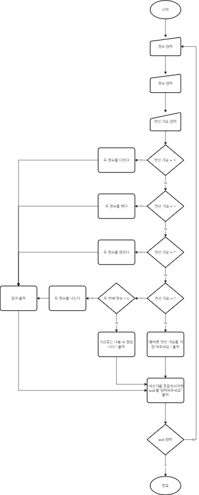

# 계산기 만들기
feat.내일배움 캠프

---

### 필수 기능
#### LV. 1 클래스 없이 기본적인 연산을 수행 할 수 있는 계산기 만들기.
- 요구사항 정의
  - [x] 양의 정수(0 포함) 입력
    - [x] Scanner 사용
    - [x] 한 개씩 입력 받기(입력 후 엔터)
  - [x] 사칙연산 입력 받기
    - [x] Scanner 사용
    - [x] char 타입으로 저장
  - [x] 입력값들로 연산 수행 후 결과 출력
    - [x] 제어문 사용
    - [x] 오류 내용 출력
  - [x] 반복 수행
    - [x] 반복문 사용
    - [x] exit 문자열 입력 시 반복 종료
- 설계
  - 동작 흐름도

    
  - 기능 분해
    
      | 케이스     | 설명              | 예외                   |
      |---------|:----------------|:---------------------|
      | ```+``` | 두 정수를 더한 결과를 반환 |                      |
      | ```-``` | 두 정수를 뺀 결과를 반환  |                      |
      | ```*``` | 두 정수를 곱한 결과를 반환 |                      |
      | ```/``` | 두 정수를 나눈 결과를 반환 | 두 번째 정수가 0일 경우 예외 발생 |
  
#### LV. 2 클래스를 적용해 기본적인 연산을 수행할 수 있는 계산기 만들기
- 요구사항 정의
  - [x] 연산결과를 저장하는 컬렉션 타입 필드를 가진 Calculator 클래스를 생성
  - [x] 사칙연산을 수행 후, 결과값 반환 메서드 구현
  - [x] 연산 수행 역할은 Calculator 클래스가 담당
  - [x] 연산 결과는 Calculator 클래스의 연산결과를 저장하는 필드에 저장
  - [x] 연산결과를 저장하는 필드의 접근제어자는 private로 지정, 간접 접근으로 데이터 조작
  - [x] 저장된 연산결과들 중 가장 먼저 저장된 데이터를 삭제하는 기능을 가진 메서드 구현

- 설계
  - 클래스 다이어그램
  
    
  
  - 기능 분해
  
    | 기능명     | 설명                           | 예외                   |
    |---------|:-----------------------------|:---------------------|
    | 더하기     | 두 정수를 더한 결과를 반환              |                      |
    | 빼기      | 두 정수를 뺀 결과를 반환               |                      |
    | 곱하기     | 두 정수를 곱한 결과를 반환              |                      |
    | 나누기     | 두 정수를 나눈 결과를 반환              | 두 번째 정수가 0일 경우 예외 발생 |
    | 연산결과 저장 | 연산결과를 저장                     |                      |
    | 연산결과 삭제 | 저장된 연산 결과 중 가장 먼저 저장된 데이터 삭제 |                      |
 
#### LV. 3 도전 기능 만들기
- 요구사항 정의
  - [x] Enum 타입을 사용해서 연산자 타입 관리
  - [x] double 타입의 값을 전달 받아도 연산 가능하게 변경
    - [x] 제네릭 사용
    - [x] 피연산자를 여러 타입으로 받을 수 있도록 기능 확장
        - [X] ArithmeticCalculator 클래스의 연산 메서드 추가(메서드명 : calculate)
  - [x] 저장된 연산 결과 중 Scanner로 입력받은 값보다 큰 결과값들을 출력
    - [x] ArithmeticCalculator 클래스에 메서드로 구현
    - [x] Lamda와 Stream을 활용하여 구현 

- 설계
    - 클래스 다이어그램

      

    - 기능 분해

      | 기능명         | 설명                               | 예외                   |
      |-------------|:---------------------------------|:---------------------|
      | 더하기         | 두 수를 더한 결과를 반환                   |                      |
      | 빼기          | 두 수를 뺀 결과를 반환                    |                      |
      | 곱하기         | 두 수를 곱한 결과를 반환                   |                      |
      | 나누기         | 두 수를 나눈 결과를 반환                   | 두 번째 정수가 0일 경우 예외 발생 |
      | 연산결과 저장     | 연산결과를 저장                         |                      |
      | 연산결과 삭제     | 저장된 연산 결과 중 가장 먼저 저장된 데이터 삭제     |                      |
      | 결과값 비교 및 출력 | 저장된 연산 결과 중 입력받은 값보다 큰 결과 값들을 출력 |                      |