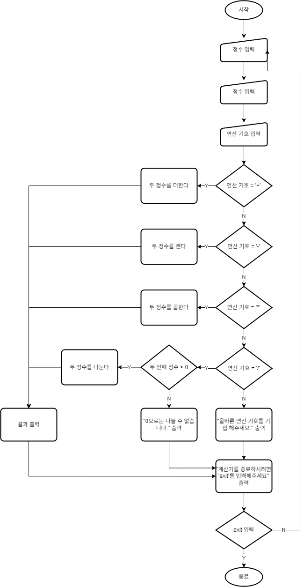

# 계산기 만들기
feat.내일배움 캠프

---

### 필수 기능
#### LV1. 클래스 없이 기본적인 연산을 수행 할 수 있는 계산기 만들기.
- 요구사항 정의
  - 양의 정수(0 포함) 입력
    - Scanner 사용
    - 한 개씩 입력 받기(입력 후 엔터)
  - 사칙연산 입력 받기
    - Scanner 사용
    - char 타입으로 저장
  - 입력값들로 연산 수행 후 결과 출력
    - 제어문 사용
    - 오류 내용 출력
  - 반복 수행
    - 반복문 사용
    - exit 문자열 입력 시 반복 종료
- 설계
  - 동작 흐름도

    
  - 기능 분해
    
      | 메서드명               | 설명              | 예외                   |
      |--------------------|:----------------|:---------------------|
      | add(int, int)      | 두 정수를 더한 결과를 반환 |                      |
      | subtract(int, int) | 두 정수를 뺀 결과를 반환  |                      |
      | multiply(int, int) | 두 정수를 곱한 결과를 반환 |                      |
      | divide(int, int)   | 두 정수를 나눈 결과를 반환 | 두 번째 정수가 0일 경우 예외 발생 |
  